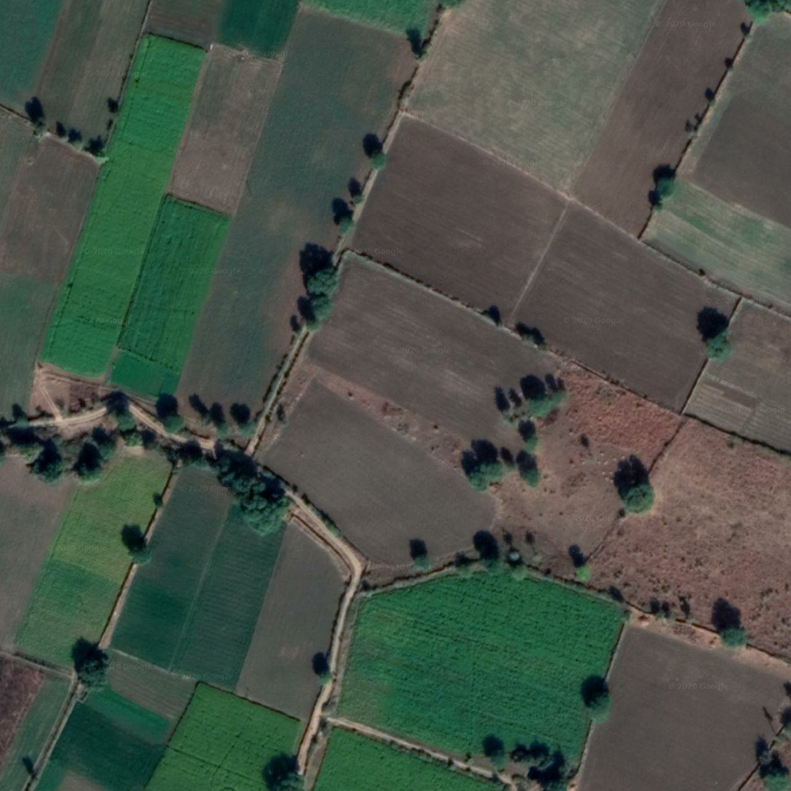
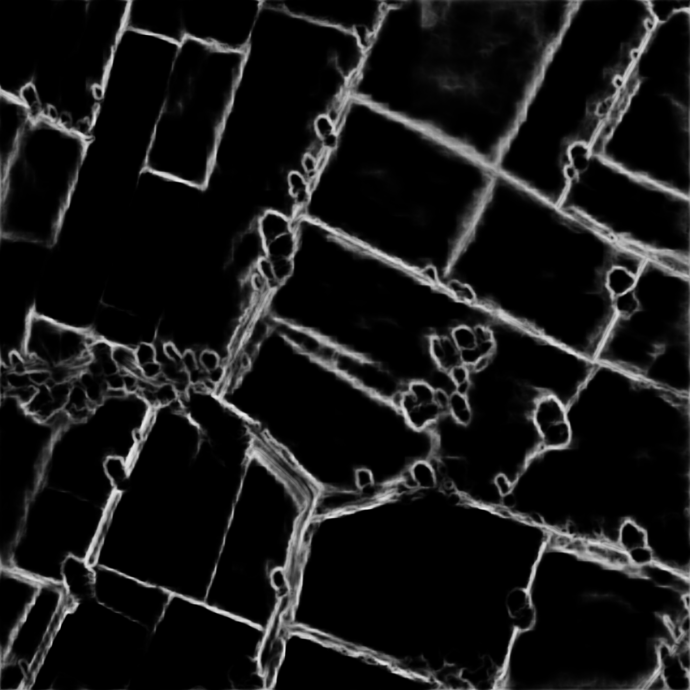
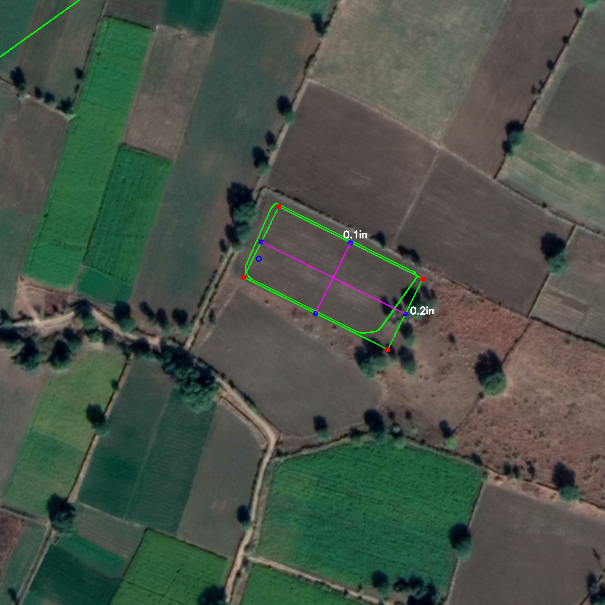

# Field-Detection-in-Satellite-Images

#### Scrapped Image

#### Filtered Image

#### Coordinates Marked on image

#### Field Detection

### Note : 
hed_pretrained_bsds.caffemodel is not included here as it was large enough to be included in github.
